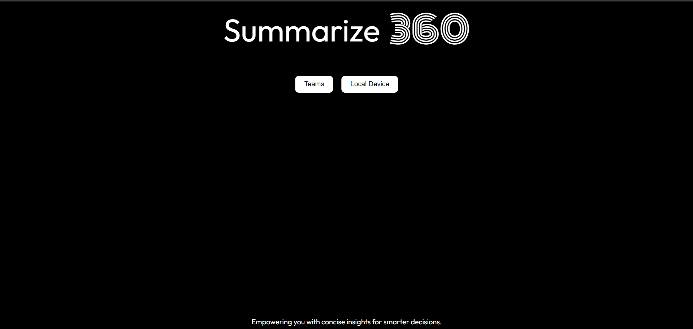

# Meeting-Summarizer-and-plan-of-action-generator-using-NLP

## Overview
This project leverages advanced Natural Language Processing (NLP) techniques to provide comprehensive meeting summaries and actionable plans. It processes video/audio files to extract key information, analyze sentiment and tone, and generate summaries. Additionally, it includes a feature to send emails with the summarized information to respective recipients.

## Features
- **Video/Audio Processing:** Converts video files to audio using `ffmpeg` and removes silent regions using `pydub`.
- **Transcription:** Uses OpenAI's Whisper `base-model` to transcribe audio files into text.
- **Summarization:** Utilizes OpenAI's `GPT-3.5 Turbo` model to generate meeting summaries.
- **Sentiment and Tone Analysis:** Analyzes the sentiment and tone of the meeting content.
- **Plan of Action:** Generates a plan of action based on the meeting content.
- **Email Sending:** Sends the summarized information and plan of action to predefined recipients.

  
## Project Screenshots  

### Summarizer  



### Mail Management System


## Audio Processing and Text Preprocessing

### Audio Processing

The project utilizes several audio processing techniques to prepare meeting recordings for analysis and summarization:

- **Conversion to Audio:** Video files are converted to audio using `ffmpeg`, facilitating easier processing of the meeting content without visual data.
  
- **Silent Region Removal:** `pydub` is employed to remove silent regions from the audio files. This preprocessing step helps in focusing the analysis on meaningful speech segments, improving the accuracy of transcription and subsequent NLP tasks.

### Text Preprocessing

Before applying Natural Language Processing (NLP) techniques to extract meeting summaries and plans of action, the transcribed text undergoes preprocessing to enhance the quality of analysis:

- **Tokenization:** The transcribed text is segmented into individual tokens (words or phrases) to facilitate further analysis.
  
- **Stopword Removal:** Common stopwords (e.g., "the", "is", "and") are removed from the text to reduce noise and improve the relevance of extracted information.


These preprocessing steps are crucial for optimizing the performance of the summarization and sentiment analysis models, ensuring that the generated summaries are concise, relevant, and accurately reflect the content and sentiment of the meetings.


## Email Management System

The project automates email communication by dynamically sending summarized meeting information and plans of action to designated recipients based on predefined configurations stored in a JSON file.

### Configuration Using JSON

The project utilizes a structured JSON file to manage recipients based on different meeting types or categories. This approach allows for flexible and customizable email distribution without hardcoding recipient lists in the application code.


### JSON Structure 

```json
{
  "Sales pitch": [
    "sales_pitch_recipient1@example.com",
    "sales_pitch_recipient2@example.com",
    "sales_pitch_recipient3@example.com"
  ],
  "Team meeting": [
    "team_meeting_recipient1@example.com",
    "team_meeting_recipient2@example.com",
    "team_meeting_recipient3@example.com",
    "team_meeting_recipient4@example.com"
  ],
  "Project update": [
    "project_update_recipient1@example.com",
    "project_update_recipient2@example.com",
    "project_update_recipient3@example.com"
  ],
  "Client meeting": [
    "client_meeting_recipient1@example.com",
    "client_meeting_recipient2@example.com",
    "client_meeting_recipient3@example.com",
    "client_meeting_recipient4@example.com"
  ]
}
